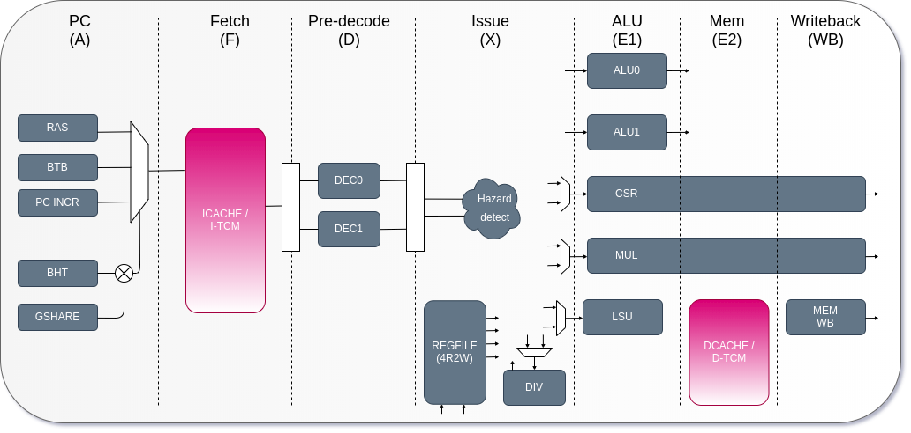
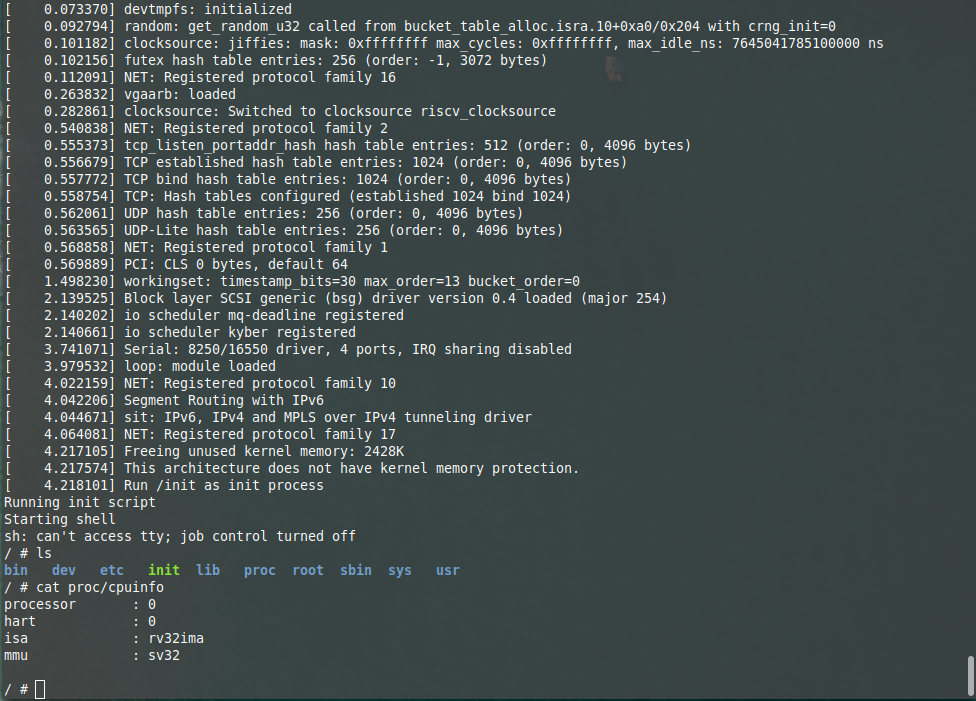

# biRISC-V - 32-bit dual issue RISC-V CPU

Github: [http://github.com/ultraembedded/biriscv](http://github.com/ultraembedded/biriscv)



## Features
* 32-bit RISC-V ISA CPU core.
* Superscalar (dual-issue) in-order 6 or 7 stage pipeline.
* Support RISC-V’s integer (I), multiplication and division (M), and CSR instructions (Z) extensions (RV32IMZicsr).
* Branch prediction (bimodel/gshare) with configurable depth branch target buffer (BTB) and return address stack (RAS).
* 64-bit instruction fetch, 32-bit data access.
* 2 x integer ALU (arithmetic, shifters and branch units).
* 1 x load store unit, 1 x out-of-pipeline divider.
* Issue and complete up to 2 independent instructions per cycle.
* Supports user, supervisor and machine mode privilege levels.
* Basic MMU support - capable of booting Linux with atomics (RV-A) SW emulation.
* Implements base ISA spec [v2.1](docs/riscv_isa_spec.pdf) and privileged ISA spec [v1.11](docs/riscv_privileged_spec.pdf).
* Verified using [Google's RISCV-DV](https://github.com/google/riscv-dv) random instruction sequences using cosimulation against [C++ ISA model](https://github.com/ultraembedded/exactstep).
* Support for instruction / data cache, AXI bus interfaces or tightly coupled memories.
* Configurable number of pipeline stages, result forwarding options, and branch prediction resources.
* Synthesizable Verilog 2001, Verilator and FPGA friendly.
* Coremark:  **4.1 CoreMark/MHz**
* Dhrystone: **1.9 DMIPS/MHz** ('legal compile options' / 337 instructions per iteration)

## Documentation
* [Configuration](docs/configuration.md)
* [Booting Linux](docs/linux.md)

## Similar Cores
* [SiFive E76](https://www.sifive.com/cores/e76)
  * RV32IMAFC
  * Dual issue in-order 8 stage pipeline
  * 4 ALU units (2 early, 2 late)
  * -*Commercial closed source core/$$*
* [WD SweRV RISC-V Core EH1](https://github.com/chipsalliance/Cores-SweRV)
  * RV32IMC
  * Dual issue in-order 9 stage pipeline
  * 4 ALU units (2 early, 2 late)
  * -*System Verilog + auto signal hookup*
  * -*No data cache option*
  * -*Not able to boot Linux*

## Project Aims
* Boot Linux all the way to a functional userspace environment.
* Achieve competitive performance for this class of in-order machine (i.e. aim for 80% of WD SweRV CoreMark score).
* Reasonable PPA / FPGA resource friendly.
* Fit easily onto cheap hobbyist FPGAs (e.g. Xilinx Artix 7) without using all LUT resources and synthesize > 50MHz.
* Support various cache and TCM options.
* Be constructed using readable, maintainable and documented IEEE 1364-2001 Verilog.
* Simulate in open-source tools such as Verilator and Icarus Verilog.
* *In later releases, add support for atomic extensions.*

*Booting the stock Linux 5.0.0-rc8 kernel built for RV32IMA to userspace on a Digilent Arty Artix 7 with biRISC-V (with atomic instructions emulated in the bootloader);*


## Prior Work
Based on my previous work;
* Github: [http://github.com/ultraembedded/riscv](http://github.com/ultraembedded/riscv)

## Getting Started

#### Cloning

To clone this project and its dependencies;

```
git clone --recursive https://github.com/ultraembedded/biriscv.git

```

#### Running Helloworld

To run a simple test image on the core RTL using Icarus Verilog;

```
# Install Icarus Verilog (Debian / Ubuntu / Linux Mint)
sudo apt-get install iverilog

# [or] Install Icarus Verilog (Redhat / Centos)
#sudo yum install iverilog

# Run a simple test image (test.elf)
cd tb/tb_core_icarus
make
```

The expected output is;
```
Starting bench
VCD info: dumpfile waveform.vcd opened for output.

Test:
1. Initialised data
2. Multiply
3. Divide
4. Shift left
5. Shift right
6. Shift right arithmetic
7. Signed comparision
8. Word access
9. Byte access
10. Comparision
```

#### Configuration

| Param Name                | Valid Range          | Description                                   |
| ------------------------- |:--------------------:| ----------------------------------------------|
| SUPPORT_SUPER             | 1/0                  | Enable supervisor / user privilege levels.    |
| SUPPORT_MMU               | 1/0                  | Enable basic memory management unit.          |
| SUPPORT_MULDIV            | 1/0                  | Enable HW multiply / divide (RV-M).           |
| SUPPORT_DUAL_ISSUE        | 1/0                  | Support superscalar operation.                |
| SUPPORT_LOAD_BYPASS       | 1/0                  | Support load result bypass paths.             |
| SUPPORT_MUL_BYPASS        | 1/0                  | Support multiply result bypass paths.         |
| SUPPORT_REGFILE_XILINX    | 1/0                  | Support Xilinx optimised register file.       |
| SUPPORT_BRANCH_PREDICTION | 1/0                  | Enable branch prediction structures.          |
| NUM_BTB_ENTRIES           | 2 -                  | Number of branch target buffer entries.       |
| NUM_BTB_ENTRIES_W         | 1 -                  | Set to log2(NUM_BTB_ENTRIES).                 |
| NUM_BHT_ENTRIES           | 2 -                  | Number of branch history table entries.       |
| NUM_BHT_ENTRIES_W         | 1 -                  | Set to log2(NUM_BHT_ENTRIES_W).               |
| BHT_ENABLE                | 1/0                  | Enable branch history table based prediction. |
| GSHARE_ENABLE             | 1/0                  | Enable GSHARE branch prediction algorithm.    |
| RAS_ENABLE                | 1/0                  | Enable return address stack prediction.       |
| NUM_RAS_ENTRIES           | 2 -                  | Number of return stack addresses supported.   |
| NUM_RAS_ENTRIES_W         | 1 -                  | Set to log2(NUM_RAS_ENTRIES_W).               |
| EXTRA_DECODE_STAGE        | 1/0                  | Extra decode pipe stage for improved timing.  |
| MEM_CACHE_ADDR_MIN        | 32'h0 - 32'hffffffff | Lowest cacheable memory address.              |
| MEM_CACHE_ADDR_MAX        | 32'h0 - 32'hffffffff | Highest cacheable memory address.             |
